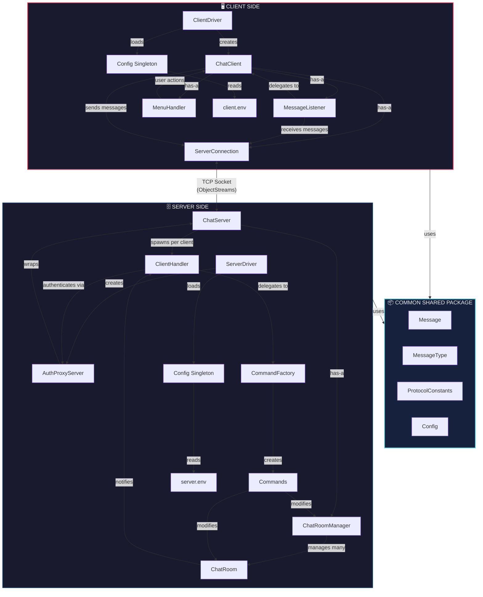
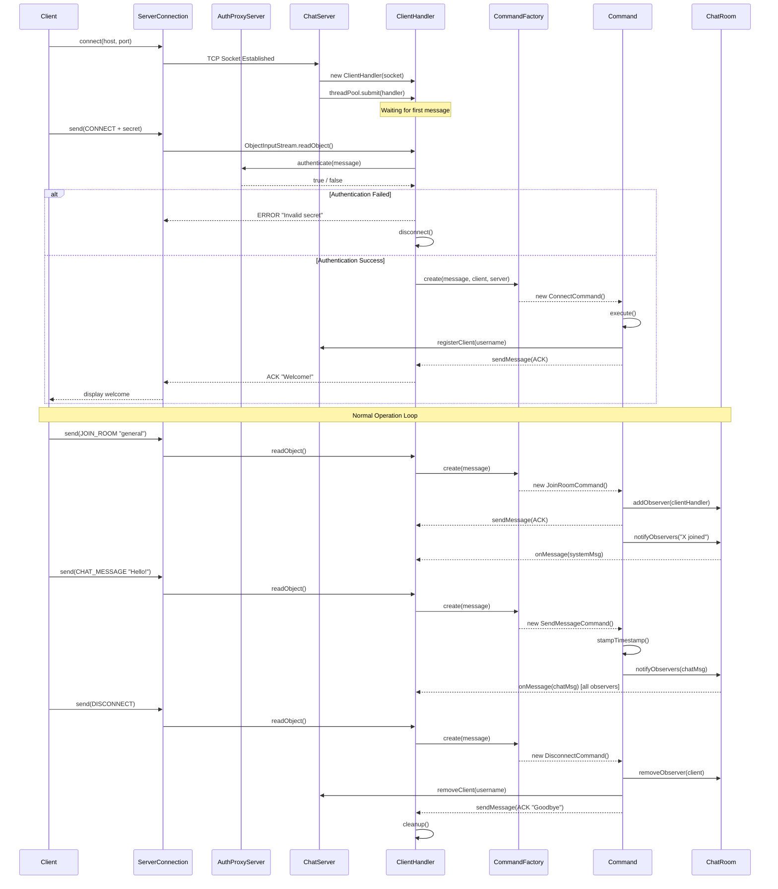
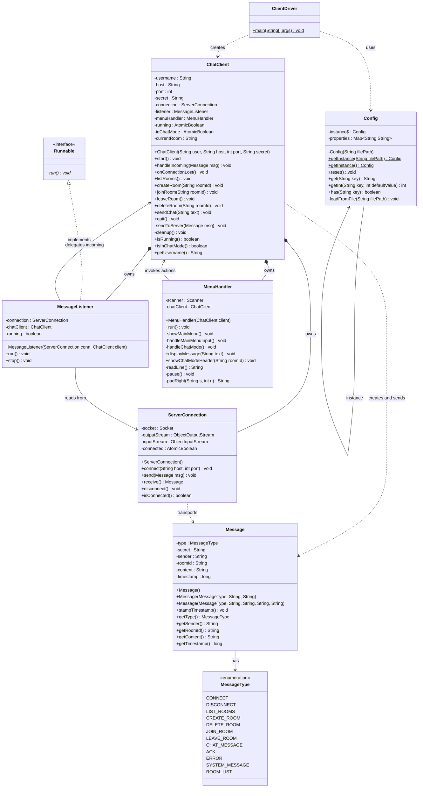
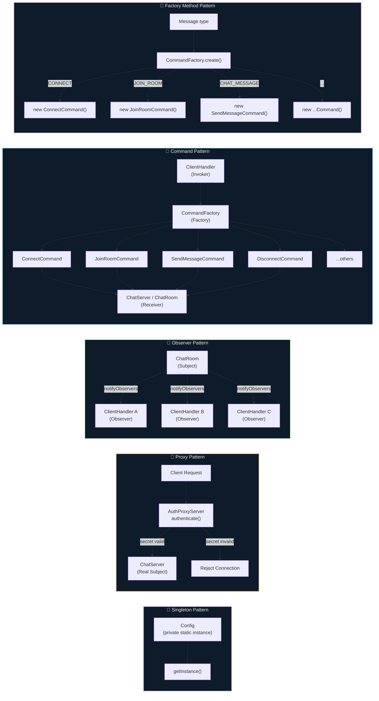
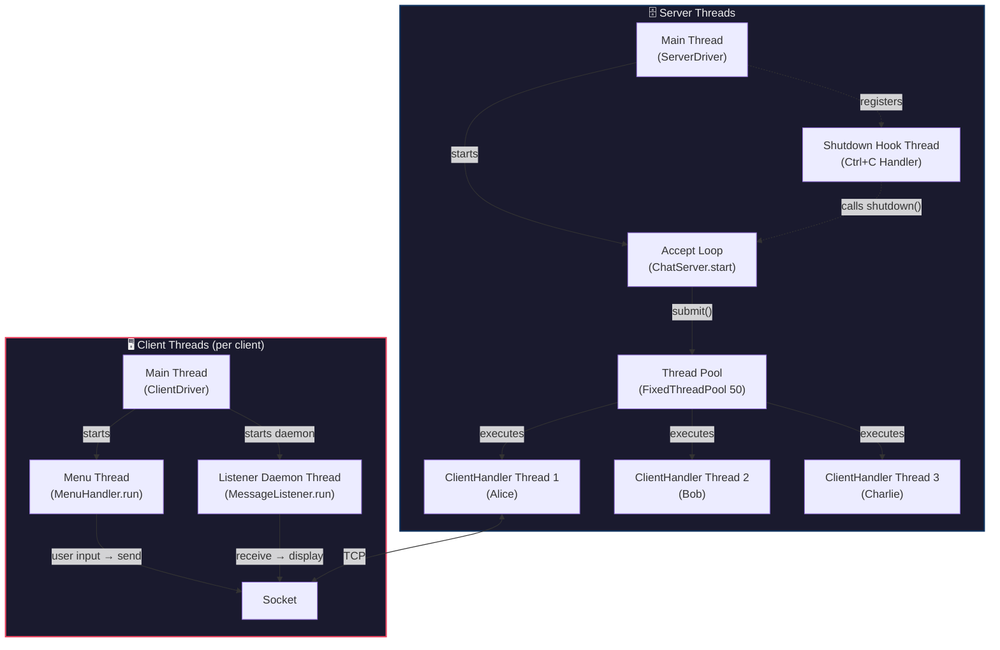

# Architecture & Class Diagrams in Mermaid

---

## 1. System Architecture Diagram

---

## 2. Communication Flow Diagram

---

## 3. Server-Side Class Diagram

```mermaid
classDiagram
    direction TB

    class ServerDriver {
        +main(String[] args)$ void
        -registerShutdownHook(AuthProxyServer proxy)$ void
    }

    class Config {
        -instance$ : Config
        -properties : Map~String String~
        -Config(String filePath)
        +getInstance(String filePath)$ Config
        +getInstance()$ Config
        +reset()$ void
        +get(String key) String
        +getInt(String key, int defaultValue) int
        +has(String key) boolean
        -loadFromFile(String filePath) void
    }

    class AuthProxyServer {
        -realServer : ChatServer
        -secret : String
        +AuthProxyServer(ChatServer server, String secret)
        +start() void
        +shutdown() void
        +authenticate(Message msg) boolean
    }

    class ChatServer {
        -port : int
        -serverSocket : ServerSocket
        -clients : ConcurrentHashMap~String ClientHandler~
        -roomManager : ChatRoomManager
        -threadPool : ExecutorService
        -running : AtomicBoolean
        -authProxy : AuthProxyServer
        +ChatServer(int port)
        +setAuthProxy(AuthProxyServer proxy) void
        +start() void
        +shutdown() void
        +registerClient(String username, ClientHandler handler) void
        +removeClient(String username) void
        +isUsernameTaken(String name) boolean
        +getRoomManager() ChatRoomManager
    }

    class ClientHandler {
        -socket : Socket
        -inputStream : ObjectInputStream
        -outputStream : ObjectOutputStream
        -username : String
        -authenticated : boolean
        -running : boolean
        -server : ChatServer
        -authProxy : AuthProxyServer
        -currentRoom : String
        +ClientHandler(Socket s, ChatServer srv, AuthProxyServer auth)
        +run() void
        +sendMessage(Message msg) void
        +disconnect() void
        -cleanup() void
        +onMessage(Message msg) void
        +getObserverName() String
        +getUsername() String
        +setUsername(String name) void
        +getCurrentRoom() String
        +setCurrentRoom(String room) void
    }

    class ChatRoomManager {
        -rooms : ConcurrentHashMap~String ChatRoom~
        +ChatRoomManager()
        +createRoom(String id, String creator) ChatRoom
        +deleteRoom(String id, String requester) boolean
        +getRoom(String id) ChatRoom
        +listRooms() String
        +removeClientFromAllRooms(ChatRoomObserver observer) void
    }

    class ChatRoom {
        -roomId : String
        -creator : String
        -observers : CopyOnWriteArrayList~ChatRoomObserver~
        +ChatRoom(String roomId, String creator)
        +addObserver(ChatRoomObserver o) void
        +removeObserver(ChatRoomObserver o) void
        +notifyObservers(Message msg) void
        +notifyAndClear(String reason) void
        +hasObserver(ChatRoomObserver o) boolean
        +getObserverCount() int
        +getRoomId() String
        +getCreator() String
        +getObservers() List~ChatRoomObserver~
    }

    class ChatRoomSubject {
        <<interface>>
        +addObserver(ChatRoomObserver o)* void
        +removeObserver(ChatRoomObserver o)* void
        +notifyObservers(Message msg)* void
    }

    class ChatRoomObserver {
        <<interface>>
        +onMessage(Message msg)* void
        +getObserverName()* String
    }

    class Command {
        <<interface>>
        +execute()* void
    }

    class CommandFactory {
        -CommandFactory()
        +create(Message msg, ClientHandler client, ChatServer server)$ Command
    }

    class ConnectCommand {
        -msg : Message
        -client : ClientHandler
        -server : ChatServer
        +ConnectCommand(Message, ClientHandler, ChatServer)
        +execute() void
    }

    class DisconnectCommand {
        -client : ClientHandler
        -server : ChatServer
        +DisconnectCommand(ClientHandler, ChatServer)
        +execute() void
    }

    class JoinRoomCommand {
        -msg : Message
        -client : ClientHandler
        -server : ChatServer
        +JoinRoomCommand(Message, ClientHandler, ChatServer)
        +execute() void
    }

    class LeaveRoomCommand {
        -msg : Message
        -client : ClientHandler
        -server : ChatServer
        +LeaveRoomCommand(Message, ClientHandler, ChatServer)
        +execute() void
    }

    class CreateRoomCommand {
        -msg : Message
        -client : ClientHandler
        -server : ChatServer
        +CreateRoomCommand(Message, ClientHandler, ChatServer)
        +execute() void
    }

    class DeleteRoomCommand {
        -msg : Message
        -client : ClientHandler
        -server : ChatServer
        +DeleteRoomCommand(Message, ClientHandler, ChatServer)
        +execute() void
    }

    class ListRoomsCommand {
        -client : ClientHandler
        -server : ChatServer
        +ListRoomsCommand(ClientHandler, ChatServer)
        +execute() void
    }

    class SendMessageCommand {
        -msg : Message
        -client : ClientHandler
        -server : ChatServer
        +SendMessageCommand(Message, ClientHandler, ChatServer)
        +execute() void
    }

    class ErrorCommand {
        -client : ClientHandler
        -errorMessage : String
        +ErrorCommand(ClientHandler, String)
        +execute() void
    }

    class Message {
        -type : MessageType
        -secret : String
        -sender : String
        -roomId : String
        -content : String
        -timestamp : long
        +Message()
        +Message(MessageType, String, String)
        +Message(MessageType, String, String, String, String)
        +stampTimestamp() void
        +getType() MessageType
        +setType(MessageType) void
        +getSecret() String
        +getSender() String
        +getRoomId() String
        +getContent() String
        +getTimestamp() long
    }

    class MessageType {
        <<enumeration>>
        CONNECT
        DISCONNECT
        LIST_ROOMS
        CREATE_ROOM
        DELETE_ROOM
        JOIN_ROOM
        LEAVE_ROOM
        CHAT_MESSAGE
        ACK
        ERROR
        SYSTEM_MESSAGE
        ROOM_LIST
    }

    %% ===== RELATIONSHIPS =====

    %% Dependency: ServerDriver creates AuthProxyServer
    ServerDriver ..> AuthProxyServer : creates
    ServerDriver ..> Config : uses

    %% Composition: AuthProxyServer wraps ChatServer (Proxy Pattern)
    AuthProxyServer *-- ChatServer : wraps

    %% Composition: ChatServer owns ChatRoomManager
    ChatServer *-- ChatRoomManager : owns

    %% Aggregation: ChatServer manages multiple ClientHandlers
    ChatServer o-- "0..*" ClientHandler : manages

    %% Composition: ChatRoomManager owns ChatRooms
    ChatRoomManager *-- "0..*" ChatRoom : owns

    %% Realization: ChatRoom implements ChatRoomSubject
    ChatRoomSubject <|.. ChatRoom : implements

    %% Realization: ClientHandler implements ChatRoomObserver
    ChatRoomObserver <|.. ClientHandler : implements

    %% Realization: ClientHandler implements Runnable
    Runnable <|.. ClientHandler : implements

    %% Association: ChatRoom observes many ChatRoomObservers
    ChatRoom --> "0..*" ChatRoomObserver : notifies

    %% Dependency: ClientHandler uses AuthProxyServer
    ClientHandler ..> AuthProxyServer : authenticates via

    %% Dependency: ClientHandler uses CommandFactory
    ClientHandler ..> CommandFactory : delegates to

    %% Dependency: CommandFactory creates Command objects
    CommandFactory ..> Command : creates

    %% Realization: All concrete commands implement Command
    Command <|.. ConnectCommand : implements
    Command <|.. DisconnectCommand : implements
    Command <|.. JoinRoomCommand : implements
    Command <|.. LeaveRoomCommand : implements
    Command <|.. CreateRoomCommand : implements
    Command <|.. DeleteRoomCommand : implements
    Command <|.. ListRoomsCommand : implements
    Command <|.. SendMessageCommand : implements
    Command <|.. ErrorCommand : implements

    %% Dependency: Commands use ChatServer
    ConnectCommand ..> ChatServer : uses
    DisconnectCommand ..> ChatServer : uses
    JoinRoomCommand ..> ChatServer : uses
    LeaveRoomCommand ..> ChatServer : uses
    CreateRoomCommand ..> ChatServer : uses
    DeleteRoomCommand ..> ChatServer : uses
    ListRoomsCommand ..> ChatServer : uses
    SendMessageCommand ..> ChatServer : uses

    %% Dependency: Commands use ClientHandler
    ConnectCommand ..> ClientHandler : uses
    SendMessageCommand ..> ChatRoom : broadcasts via

    %% Association: Message contains MessageType
    Message --> MessageType : has

    %% Config is Singleton
    Config --> Config : instance
```

---

## 4. Client-Side Class Diagram

---

## 5. Design Patterns Highlight Diagram

---

## 6. Thread Model Diagram

---

