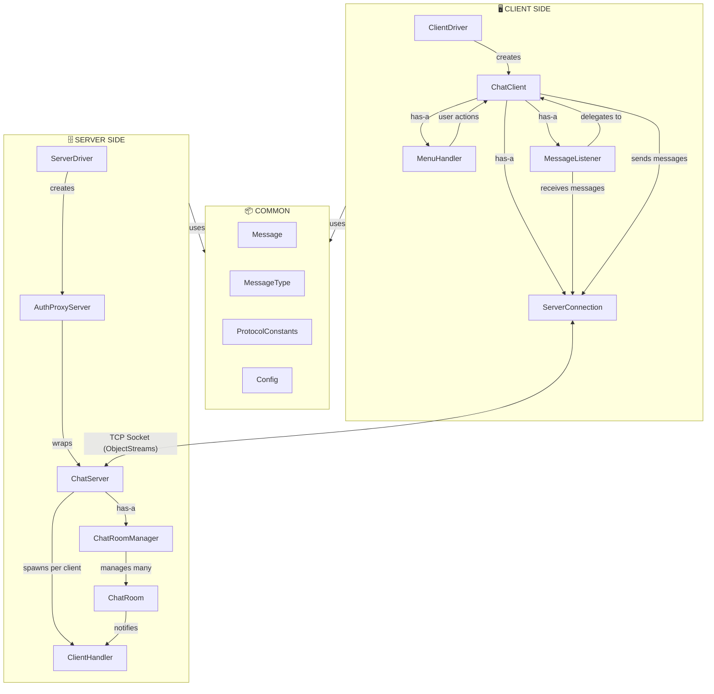

# 💬 Java Socket-Based Chat Application

A real-time, multi-client chat application built with Java sockets.

---

## ✨ Features

- **Real-time Messaging** — Instant delivery via Observer pattern
- **Multiple Chat Rooms** — Create, join, leave, delete dynamically
- **Authentication** — Shared-secret based via Proxy pattern
- **Multi-client Support** — Thread pool handles 50 concurrent clients
- **Graceful Shutdown** — Ctrl+C cleanly disconnects all clients
- **Dead Client Detection** — Auto-removal of disconnected clients
- **Server-side Timestamps** — Consistent time across all messages
- **Configurable** — Settings loaded from `.env` files

---

## 🎨 Design Patterns

| # | Pattern | Where |
|---|---------|-------|
| 1 | **Singleton** | `Config.java` — single config instance |
| 2 | **Proxy** | `AuthProxyServer.java` — authentication gate |
| 3 | **Observer** | `ChatRoom` ↔ `ClientHandler` — message broadcast |
| 4 | **Template Method** | `ClientHandler.run()` — standardized connection lifecycle |

---

## 📁 Project Structure

```
project/
├── common/
│   ├── Config.java              # Singleton config loader
│   ├── Message.java             # Serializable message POJO
│   ├── MessageType.java         # Enum — protocol message types
│   └── ProtocolConstants.java   # Shared constants
│
├── server/
│   ├── ServerDriver.java        # Entry point
│   ├── ChatServer.java          # Core server — accepts connections
│   ├── AuthProxyServer.java     # Proxy — authenticates clients
│   ├── ClientHandler.java       # Per-client thread — handles all message types
│   ├── ChatRoom.java            # Observable — holds connected clients
│   └── ChatRoomManager.java     # Manages all rooms
│
├── client/
│   ├── ClientDriver.java        # Entry point
│   ├── ChatClient.java          # Main controller
│   ├── ServerConnection.java    # Socket manager
│   ├── MessageListener.java     # Daemon thread — receives messages
│   └── MenuHandler.java         # Console UI
│
└── resources/
    ├── server.env
    └── client.env
```

---

## 🏗️ Architecture



**Server:** `ServerDriver` starts `AuthProxyServer` which wraps `ChatServer`. Each accepted connection spawns a `ClientHandler` thread. Incoming messages are handled directly in `ClientHandler` via a switch block. `ChatRoom` broadcasts messages to all connected `ClientHandler`s.

**Client:** `ClientDriver` starts `ChatClient` which manages `ServerConnection` (transport), `MessageListener` (receives on a daemon thread), and `MenuHandler` (console UI on the main thread).

---

## 📋 Prerequisites

- **JDK 8+**
- **2+ Terminal windows** (one server, one+ clients)

---

## ⚙️ Configuration

**`resources/server.env`**
```properties
PORT=9000
SECRET=my_super_secret_key_123
```

**`resources/client.env`**
```properties
HOST=localhost
PORT=9000
SECRET=my_super_secret_key_123
```

> ⚠️ `SECRET` must match in both files.

---

## 🔨 Compilation & Execution

### Compile

```bash
mkdir -p out
javac -d out common/*.java server/*.java client/*.java
```

Or use the provided script:
```bash
bash compile.sh
```

### Start Server (Terminal 1)

```bash
java -cp out server.ServerDriver
```

### Start Client (Terminal 2, 3, ...)

```bash
java -cp out client.ClientDriver
```

---

## 📖 Usage

### Main Menu

| Option | Action |
|--------|--------|
| `1` | List all rooms with member counts |
| `2` | Create a new room (you become owner) |
| `3` | Join a room and enter chat mode |
| `4` | Delete a room you created |
| `5` | Disconnect and exit |

### Chat Mode

| Input | Action |
|-------|--------|
| *any text* | Send message to room |
| `/leave` | Leave room → return to menu |
| `/help` | Show commands |

---

## 🔒 Thread Safety

| Mechanism | Purpose |
|-----------|---------|
| `ConcurrentHashMap` | Thread-safe client/room maps |
| `CopyOnWriteArrayList` | Safe observer iteration during broadcast |
| `AtomicBoolean` | Lock-free state flags |
| `synchronized sendMessage()` | Prevents interleaved socket writes |
| `ObjectOutputStream.reset()` | Prevents stale cached objects |
| Output-before-Input streams | Prevents initialization deadlock |
| Daemon listener thread | Auto-terminates on client exit |
| `finally` cleanup blocks | Guarantees resource cleanup on any exit |

---

## ⚠️ Error Handling

| Scenario | Response |
|----------|----------|
| Missing config file | Exit with error message |
| Wrong secret | Connection rejected |
| Duplicate username | ERROR sent, can retry |
| Room not found | ERROR sent to client |
| Delete by non-creator | ERROR sent |
| Client crash | Auto-cleanup via IOException detection |
| Server crash | Client detects, exits gracefully |
| Ctrl+C on server | Shutdown hook disconnects all clients |

---

## 📄 License

Developed as a **Design Patterns** course project for academic purposes.

---

*Built with ☕ Java*
