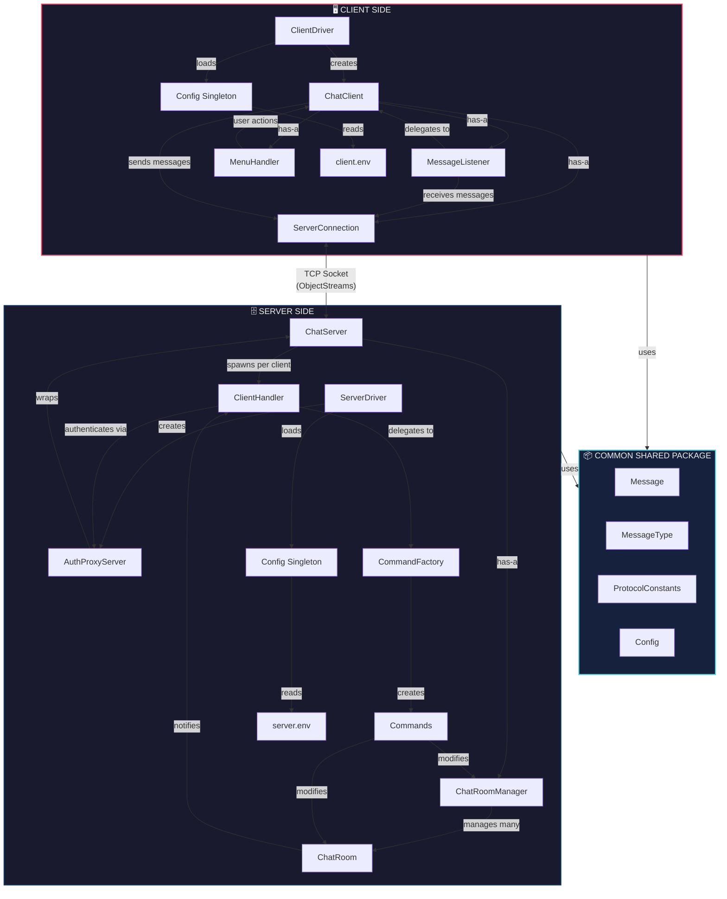

# 💬 Java Socket-Based Chat Application

A real-time, multi-client chat application built with Java sockets, demonstrating **7 design patterns** in a clean, modular architecture.

---

## ✨ Features

- **Real-time Messaging** — Instant delivery via Observer pattern
- **Multiple Chat Rooms** — Create, join, leave, delete dynamically
- **Authentication** — Shared-secret based via Proxy pattern
- **Multi-client Support** — Thread pool handles 50 concurrent clients
- **Graceful Shutdown** — Ctrl+C cleanly disconnects all clients
- **Dead Client Detection** — Auto-removal of disconnected clients
- **Server-side Timestamps** — Consistent time across all messages
- **Configurable** — Settings loaded from `.env` files

---

## 🎨 Design Patterns

| # | Pattern | Where |
|---|---------|-------|
| 1 | **Singleton** | `Config.java` — single config instance |
| 2 | **Proxy** | `AuthProxyServer.java` — authentication gate |
| 3 | **Observer** | `ChatRoom` ↔ `ClientHandler` — message broadcast |
| 4 | **Command** | Concrete command classes — encapsulate actions |
| 5 | **Factory Method** | `CommandFactory` — creates commands by message type |
| 6 | **Template Method** | `ClientHandler.run()` — standardized connection lifecycle |
| 7 | **Composition over Inheritance** | `AuthProxyServer` wraps `ChatServer` |

---

## 📁 Project Structure

```
project/
├── common/                          # Shared between client & server
│   ├── Config.java                  # Singleton config loader
│   ├── Message.java                 # Serializable message POJO
│   ├── MessageType.java             # Enum — protocol message types
│   └── ProtocolConstants.java       # Shared constants
│
├── server/
│   ├── ServerDriver.java            # Entry point
│   ├── ChatServer.java              # Core server — accepts connections
│   ├── AuthProxyServer.java         # Proxy — authenticates clients
│   ├── ClientHandler.java           # Per-client thread + Observer
│   ├── ChatRoom.java                # Observable Subject
│   ├── ChatRoomManager.java         # Manages all rooms
│   ├── command/
│   │   ├── Command.java             # Command interface
│   │   ├── CommandFactory.java      # Factory — creates commands
│   │   ├── ConnectCommand.java
│   │   ├── DisconnectCommand.java
│   │   ├── JoinRoomCommand.java
│   │   ├── LeaveRoomCommand.java
│   │   ├── CreateRoomCommand.java
│   │   ├── DeleteRoomCommand.java
│   │   ├── ListRoomsCommand.java
│   │   ├── SendMessageCommand.java
│   │   └── ErrorCommand.java
│   └── observer/
│       ├── ChatRoomObserver.java     # Observer interface
│       └── ChatRoomSubject.java      # Subject interface
│
├── client/
│   ├── ClientDriver.java            # Entry point
│   ├── ChatClient.java              # Main controller
│   ├── ServerConnection.java        # Socket manager
│   ├── MessageListener.java         # Daemon thread — receives messages
│   └── MenuHandler.java             # Console UI
│
└── resources/
    ├── server.env
    └── client.env
```

---

## 🏗️ Architecture



**Server:** `ServerDriver` boots `AuthProxyServer` which wraps `ChatServer`. The server accepts connections, assigns each to a `ClientHandler` thread. Incoming messages go through `CommandFactory` → concrete `Command.execute()`. `ChatRoom` broadcasts messages to all observers (`ClientHandler`s).

**Client:** `ClientDriver` boots `ChatClient` which manages `ServerConnection` (transport), `MessageListener` (receives on daemon thread), and `MenuHandler` (console UI on main thread).

---

## 📋 Prerequisites

- **JDK 8+**
- **2+ Terminal windows** (one server, one+ clients)

```bash
java -version
javac -version
```

---

## ⚙️ Configuration

**`resources/server.env`**
```properties
PORT=9000
SECRET=my_super_secret_key_123
```

**`resources/client.env`**
```properties
HOST=localhost
PORT=9000
SECRET=my_super_secret_key_123
```

> ⚠️ `SECRET` must match in both files.

---

## 🔨 Compilation & Execution

### Compile

```bash
mkdir -p out

javac -d out \
    common/*.java \
    server/observer/*.java \
    server/command/*.java \
    server/*.java \
    client/*.java
```

### Start Server (Terminal 1)

```bash
java -cp out server.ServerDriver
```

```
========================================
  Chat Server started on port 9000
  Press Ctrl+C to shutdown.
========================================
```

### Start Client (Terminal 2, 3, ...)

```bash
java -cp out client.ClientDriver
```

```
Enter your username: Alice
[Server] Welcome, Alice! You are now connected.

╔══════════════════════════════╗
║        MAIN MENU             ║
╠══════════════════════════════╣
║  1. List Chat Rooms          ║
║  2. Create Chat Room         ║
║  3. Join Chat Room           ║
║  4. Delete Chat Room         ║
║  5. Quit                     ║
╚══════════════════════════════╝
```

---

## 📖 Usage

### Main Menu

| Option | Action |
|--------|--------|
| `1` | List all rooms with member counts |
| `2` | Create a new room (you become owner) |
| `3` | Join a room and enter chat mode |
| `4` | Delete a room you created |
| `5` | Disconnect and exit |

### Chat Mode

| Input | Action |
|-------|--------|
| *any text* | Send message to room |
| `/leave` | Leave room → return to menu |
| `/help` | Show commands |

### Example

```
Alice> Choose: 2 → Create "general"
Alice> Choose: 3 → Join "general"
Alice> Hello!
  [14:30:15] Alice: Hello!

Bob> Choose: 3 → Join "general"
  *** Bob has joined the room. ***

Bob> Hey Alice!
  [14:30:45] Bob: Hey Alice!

Alice> /leave
  [Server] You left room 'general'.
```

---

## 🔒 Thread Safety

| Mechanism | Purpose |
|-----------|---------|
| `ConcurrentHashMap` | Thread-safe client/room maps |
| `CopyOnWriteArrayList` | Safe observer iteration during broadcast |
| `AtomicBoolean` | Lock-free state flags |
| `synchronized sendMessage()` | Prevents interleaved socket writes |
| `ObjectOutputStream.reset()` | Prevents stale cached objects |
| Output-before-Input streams | Prevents initialization deadlock |
| Daemon listener thread | Auto-terminates on client exit |
| `finally` cleanup blocks | Guarantees resource cleanup on any exit |

---

## ⚠️ Error Handling

| Scenario | Response |
|----------|----------|
| Missing config file | Exit with error message |
| Wrong secret | Connection rejected |
| Duplicate username | ERROR sent, can retry |
| Room not found | ERROR sent to client |
| Delete by non-creator | ERROR sent |
| Client crash | Auto-cleanup via IOException detection |
| Server crash | Client detects, exits gracefully |
| Ctrl+C on server | Shutdown hook disconnects all clients |

---

## 📄 License

Developed as a **Design Patterns** course project for academic purposes.

---

*Built with ☕ Java and 7 Design Patterns*
